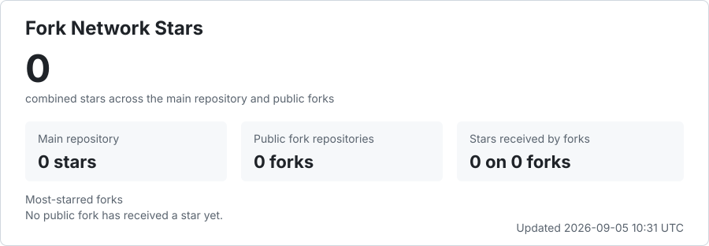

# 闲鱼工作台（Xianyu Workbench）｜多账号客服、AI 回复与自动发货

闲鱼工作台（Xianyu Workbench）是面向闲鱼卖家的开源多账号管理工具，将消息接待、人工接管、AI 自动回复、商品、订单与卡密自动发货集中到本地桌面应用中。提供 macOS Apple Silicon 和 Windows x64 安装包，也保留源码与 Docker 部署方式。本仓库是独立维护的社区分支，并非闲鱼官方客户端；上游项目名称为“闲鱼智控 / 闲鱼超级管家”。

Xianyu Workbench is an open-source desktop workspace for Xianyu sellers, with multi-account messaging, AI-assisted customer service, human handoff and digital-code delivery. Community maintained; not affiliated with Xianyu.

[](https://github.com/genoooool/xianyu-super-butler/stargazers)
[](https://github.com/genoooool/xianyu-super-butler/releases/latest)
[](https://www.python.org/)
[](https://react.dev/)
[](LICENSE)

**快速入口：** [下载最新桌面版](https://github.com/genoooool/xianyu-super-butler/releases/latest) · [常见问题](docs/faq.md) · [授权失效与续期](docs/desktop-login.md) · [部署说明](docs/deployment.md) · [版本记录](CHANGELOG.md) · [反馈问题](https://github.com/genoooool/xianyu-super-butler/issues)

## 适合谁，怎么开始

| 你的需求 | 使用方式与边界 |
| --- | --- |
| 在电脑接待多个闲鱼账号的咨询 | 下载桌面版，登录工作台后在账号管理中扫码接入自己的闲鱼账号；每条会话保留所属店铺 |
| 用固定答案或 AI 减少重复回复 | 配置店铺/商品 QA 和知识资料；AI 需要另行配置兼容 OpenAI 协议的模型服务，调用费用由服务商决定 |
| 人工处理议价、售后或复杂问题 | 使用店铺总开关和单会话人工接管；人工关闭后不会按计时器自动恢复 |
| 给数字商品发卡密或文本资料 | 先配置库存与发货规则；发送和确认发货分别检查平台回执，未知结果需要人工核对 |
| 在服务器或 NAS 上自行部署 | 使用本仓库源码构建；下文上游预构建 Docker 镜像不能等同于本分支版本 |

**1.0.3 更新：** 修复桌面端连续运行24小时后的登录失效，增加闲鱼保持登录与已验证的静默续期。平台要求手机验证，或旧授权已失效且没有长期凭证时，仍需重新扫码。详见[授权说明](docs/desktop-login.md)。

> [!IMPORTANT]
> **桌面安装只是入口，核心改动是让多店客服、AI 回复和自动发货真正可控。**
>
> - **所有店铺一起接待**：全部在线店铺的会话进入同一列表，每条消息都绑定“店铺 + 会话”，降低跨店回错买家的风险。
> - **AI 随时让人接管**：店铺总开关、单会话 AI 开关和持久人工接管分层控制；切换状态后，旧的生成结果不能延迟越权发送。
> - **发送与发货以回执为准**：只有平台明确确认成功才显示已发送或已发货；超时和未知结果不会盲目重试，减少重复发卡和错误发货状态。
> - **一套资料服务多个商品**：固定 QA、私有回复图片、店铺/商品/共用知识和多商品 QA 可以组合使用；缺少业务依据的报价或承诺会转人工。
> - **本机提醒与凭据保护**：系统通知可回到对应店铺会话；选择记住的工作台登录账号和密码进入 macOS Keychain 或 Windows Credential Manager。闲鱼授权 Cookie 保存在本机应用数据库中。
>
> [查看完整差异](#本仓库相对原系统的改动) · [下载 macOS / Windows 桌面版](https://github.com/genoooool/xianyu-super-butler/releases/latest)

集中处理多个账号的消息与订单，按实际业务配置回复、发货及买家互动规则。平台风控、账号验证和异常订单仍可能需要人工处理；项目不承诺无人值守、特定账号承载数量或零重复发货。

## 本仓库相对原系统的改动

本仓库基于 [23Star/xianyu-super-butler](https://github.com/23Star/xianyu-super-butler)，保留原系统的网页端、多账号、
订单、回复和发货能力，并针对长期多店运营中容易出现的串店、抢答、重复发送和状态误判继续加固：

| 增强方向 | 本仓库的具体改动 | 对实际运营的价值 |
| --- | --- | --- |
| 多店统一消息中心 | 默认聚合所有在线店铺会话，以“店铺 + 会话”锁定所有读取、发送、重试和通知跳转；旧会话可从可靠来源补全昵称 | 不必逐店切换查看咨询，并降低同一会话 ID 跨店串线、回错买家的风险 |
| 分层客服控制 | 店铺客服总开关、单会话 AI 开关和持久人工接管互相配合；状态带版本校验，旧生成和迟到响应不能越过新状态发送 | 忙时可以整店暂停，也能只接管一个棘手买家；人工介入后 AI 不会突然抢答 |
| 可复用回复资料 | 支持固定原文、私有回复图片、多商品 QA，以及店铺/商品/共用知识和 TXT/Markdown 导入 | 高频问题可以直接复用准确文字和图片，一份共用资料不必在每个商品下重复维护 |
| 可核验的发送状态 | 界面区分发送中、已确认、明确失败和未知结果；只有明确失败才提供二次确认重发 | 网络超时或平台异常时不会把“请求发出”误当成“买家已收到”，也不会自动盲目补发 |
| 发卡与确认发货保护 | 自动发卡逐段检查平台成功回执，确认发货也必须取得对应成功结果；买卖账号和商品归属在动作前复核 | 降低重复发卡、发错店铺，以及消息未送达却被本地标成已发货的风险 |
| 商品与订单一致性 | 增加账号筛选、商品搜索、买卖账号隔离、订单状态防倒退、退款同步和买家昵称修正 | 多账号数据更容易核对，迟到同步不会轻易把已完成或退款中的订单退回旧状态 |
| 原生桌面与系统通知 | 提供 macOS Apple Silicon 和 Windows x64 安装包，内置后端与 Chromium；新消息可显示系统提醒并返回精确会话 | 不需要自行拼装桌面运行环境，窗口不在前台时也能及时发现新咨询和待人工会话 |
| 本机登录与更新 | 记住的工作台密码存入系统凭据库，闲鱼授权 Cookie 保存在本机数据库；macOS 更新包校验签名、版本、应用身份、机型和数据兼容级别 | 区分工作台登录和平台授权，升级前检查受信任来源与版本 |

桌面版请从本仓库的 [Releases](https://github.com/genoooool/xianyu-super-butler/releases/latest) 下载。
Windows 安装包目前没有 Authenticode 签名，首次运行可能出现“未知发布者”提示。下文引用的
`ghcr.io/23star/xianyu-super-butler` 是上游 Docker 镜像，不包含本分支的桌面增强改动。

- 🏪 **多账号管理** — 扫码即接入，一个后台管完所有小号，逐账号独立配置策略
- 📦 **自动发货** — 卡密自动发出，支持多规格、多数量，发货前风险拦截
- 💬 **自动回复** — 关键词、固定 QA 与 AI 回复组合使用；价格和承诺需要业务依据，复杂情况转人工
- ⭐ **买家互动** — 确认收货后自动评价、自动求小红花、自动发送致谢文本
- 🤖 **商品自动化** — 商品同步、素材库、定时擦亮、自动上下架
- 📊 **经营看板** — 成交额、到账、退款、订单和库存一屏掌握，**历史订单可一次性拉回**


## 核心功能

| 模块 | 能力 |
| --- | --- |
| 总览 | 汇总营收、账号、订单、卡密库存和运行状态 |
| 账号 | 扫码、密码或 Cookie 登录，资料同步，监听任务状态，暂停和自动回复配置 |
| 商品 | 从闲鱼同步商品，维护本地详情、图片、规格、数量和商品回复 |
| 商品自动化 | 商品筛选、素材库、发布记录、定时删除、短链修复和补偿任务 |
| 订单 | 一键拉取闲鱼历史卖出订单，状态判定、详情补全、批量刷新、手动发货和异常保护 |
| 卡密 | 卡券分组、库存导入、状态管理、多规格和多数量发货 |
| 自动回复 | 账号关键词回复、默认回复和回复一次控制 |
| 人工智能回复 | 兼容 OpenAI 协议的大模型配置、上下文对话和测试 |
| 自动发货 | 全局、指定账号、指定商品三级发货规则及发货前风险拦截 |
| 消息管理 | 闲鱼会话列表、消息收发、搜索筛选、回复决策日志和过滤规则 |
| 通知与日志 | 通知渠道、账号绑定、风险日志和系统日志 |
| 设置 | 管理员账号与改密、注册与邮箱验证开关、服务、备份及系统配置 |
| 软件更新 | macOS 从本仓库 Release 检查签名更新；Windows 通过 Release 下载新安装包 |

## 界面预览

### 账号管理：一个后台管完所有小号

扫码添加账号，显示监听与授权状态。每个账号可独立配置自动确认和客服总开关；
人工接管按会话保持关闭，直到显式重新开启。


### 商品与发货：卡密自动发到买家手上

同步在售商品，逐个商品绑定发货内容，支持多规格和多数量。已下架的商品会被标记出来
并默认隐藏，不和在售的混在一起。


### 订单管理：接入前的历史订单也能一次拉回来

「拉取卖出订单」会把闲鱼上的历史订单整批同步进来，不只是接入之后的新单，
所以刚部署就能看到完整的经营数据。状态、买家、实付金额和发货情况一目了然，
支持按账号和状态筛选，也能手动发货或补发。


### 买家互动：确认收货后的动作全部自动完成

评价买家、索要小红花、发送收货致谢，三项都能逐账号开关。买家一确认收货，
致谢立即发出，评价和求花在订单状态就绪后自动执行。


### 消息中心：所有账号的会话在一个页面里

跨账号会话列表，支持搜索和筛选，可以直接接管对话。自动回复的每一次决策都有日志，
能查到为什么回了、为什么没回。


## 如何部署

### 桌面安装（macOS / Windows）

从[本仓库 Releases](https://github.com/genoooool/xianyu-super-butler/releases/latest)下载与你的系统匹配的文件：

- **macOS Apple Silicon（M 系列）**：下载 `darwin-aarch64.zip`，解压后将应用放入“应用程序”。目前没有在此 Release 提供已验证的 Intel Mac 安装包。
- **Windows x64**：下载 `windows-x64-setup.exe` 安装。安装包尚无 Authenticode 签名；macOS 包采用本地 ad-hoc 签名，尚未经过 Apple 公证。
- 启动后先登录工作台，再在账号管理中扫码授权闲鱼。升级前退出工作台并保留最新数据备份；已有授权是否需重扫由平台实际返回决定。

常见安装、模型费用、数据存储与适用范围问题见[FAQ](docs/faq.md)。

### 一条命令直接启动（最快，不用克隆仓库）

有 Docker 就能跑，不需要下载源码：

```bash
docker run -d --name xianyu-butler \
  -p 8080:8080 \
  -v $(pwd)/data:/app/data \
  -v $(pwd)/logs:/app/logs \
  -v $(pwd)/backups:/app/backups \
  -e ADMIN_USERNAME=admin \
  -e ADMIN_PASSWORD=改成你自己的密码 \
  --restart unless-stopped \
  ghcr.io/23star/xianyu-super-butler:latest
```

浏览器打开 `http://服务器IP:8080` 即可。数据都在当前目录的 `data` / `logs` / `backups` 里，
升级只需 `docker pull` 后重建容器，数据不丢。

Windows PowerShell 把 `$(pwd)` 换成 `${PWD}`，续行的 `\` 换成反引号 `` ` ``。

### Docker Compose（推荐长期使用）

```bash
git clone https://github.com/genoooool/xianyu-super-butler.git
cd xianyu-super-butler
docker compose -f docker-compose.nas.yml up -d
```

同样是预构建镜像，不在本机编译任何东西，支持 amd64 / arm64。相比上面一条命令，
Compose 的好处是配置写在文件里、改起来清楚，升级也只有一行命令。

该配置不依赖 `.env`，管理员账号密码在 `docker-compose.nas.yml` 里的 `CHANGE_ME` 处直接改。

### NAS 与低配设备（飞牛 fnOS、群晖、威联通、软路由、低配 VPS）

**用上面那条命令，不要本地构建。**

`npm ci`、前端打包、Python 依赖编译和 Chromium 下载会同时抢占 CPU 和内存，
轻则卡十几分钟，重则内存不足被杀，反复重启表现为「装不上、机器卡死」。
预构建镜像已同时提供 amd64 和 arm64，绕开全部编译步骤。

```bash
docker compose -f docker-compose.nas.yml up -d
```

飞牛 fnOS、群晖等图形界面的 Docker 通常没地方放 `.env`，所以这份配置把变量直接写在
compose 文件里，改完 `CHANGE_ME` 就能用。

### Docker 本地构建（需要改代码时）

```bash
cp .env.example .env          # 不改也能启动，此时使用默认密码
docker compose up -d --build
```

国内网络用 CN 配置（apt、pip、npm、Chromium 全部走国内镜像）：

```bash
docker compose -f docker-compose-cn.yml up -d --build
```

可选 Nginx：`docker compose --profile with-nginx up -d --build`

### 源码运行（开发调试）

需要 Python 3.11+、Node.js 20+、npm。

```bash
git clone https://github.com/genoooool/xianyu-super-butler.git
cd xianyu-super-butler

py -3.11 -m venv .venv
.\.venv\Scripts\Activate.ps1
python -m pip install -r requirements.txt
playwright install chromium

cd frontend && npm ci && npm run build && cd ..
python Start.py
```

### 访问

- 管理页面：`http://localhost:8080/`
- API 文档：`http://localhost:8080/docs`
- 健康检查：`http://localhost:8080/health`

默认管理员 **admin / admin123**，登录后请在「设置 → 账号与同步 → 修改登录密码」立即改掉。

数据持久化到 `./data`（数据库）、`./logs`（日志）、`./backups`（备份）。

### 更新

```bash
# 预构建镜像（推荐方式对应的更新命令）
docker compose -f docker-compose.nas.yml pull && docker compose -f docker-compose.nas.yml up -d

# 本地构建
git pull && docker compose up -d --build
```

> **滑块与人机验证、部署失败排查、使用流程** 见 [docs/deployment.md](docs/deployment.md)。
> 自动过滑块受平台风控限制不保证成功，自动失败时可在账号页转人工验证。

## 交流与反馈

<table>
  <tr>
    <th align="center">微信群</th>
    <th align="center">QQ群</th>
  </tr>
  <tr>
    <td align="center"></td>
    <td align="center"></td>
  </tr>
  <tr>
    <td align="center">二维码失效后会在仓库更新</td>
    <td align="center">群号：704866149</td>
  </tr>
</table>

本分支的缺陷和功能建议请提交到 [GitHub Issues](https://github.com/genoooool/xianyu-super-butler/issues)。

## 许可与声明

本项目基于 [zhinianboke/xianyu-auto-reply](https://github.com/zhinianboke/xianyu-auto-reply) 二次开发并持续维护，保留原项目核心能力，同时重构管理端、账号监听、商品同步、订单处理和发货规则。感谢原作者的开源工作。

项目使用 [GNU Affero General Public License v3.0](LICENSE)。修改、部署或通过网络提供服务时，请遵守 AGPL-3.0 的源代码公开义务。

本项目仅供学习、研究和合法自动化使用。使用者应遵守法律法规及平台规则，并自行承担使用风险。

## Star History

<a href="https://www.star-history.com/?type=date&repos=23Star%2Fxianyu-super-butler">
  <picture>
    <source media="(prefers-color-scheme: dark)" srcset="https://api.star-history.com/chart?repos=23Star/xianyu-super-butler&type=date&theme=dark&legend=top-left&sealed_token=AhEE4dCbaUSe6lOSCJhYlDz04x4r2C14buYVYWlJVlulk23LKk5DgHZfMIumVkiNUPsbFO--8IX-0pXCfW8nyyEN3NStTE-16pBQggRCq6gsUZRlegeZdTbWWU-UPKWAWlnyyQyndGhz-lPX0HJrKxSCriOB1fiyJljBO7eNsd4xVYkrByhViWaPMCv9" />
    <source media="(prefers-color-scheme: light)" srcset="https://api.star-history.com/chart?repos=23Star/xianyu-super-butler&type=date&legend=top-left&sealed_token=AhEE4dCbaUSe6lOSCJhYlDz04x4r2C14buYVYWlJVlulk23LKk5DgHZfMIumVkiNUPsbFO--8IX-0pXCfW8nyyEN3NStTE-16pBQggRCq6gsUZRlegeZdTbWWU-UPKWAWlnyyQyndGhz-lPX0HJrKxSCriOB1fiyJljBO7eNsd4xVYkrByhViWaPMCv9" />
    
  </picture>
</a>

Star 历史曲线实时读取 GitHub 数据，不需要人工更新。

## Fork 网络总 Star

[](https://github.com/23Star/xianyu-super-butler/network/members)

该统计在主仓库 Star 之外累加全部公开 Fork 获得的 Star，每 6 小时自动刷新。由于同一用户可能同时 Star 多个仓库，此处是各仓库 Star 数之和，并非去重后的独立用户数。
